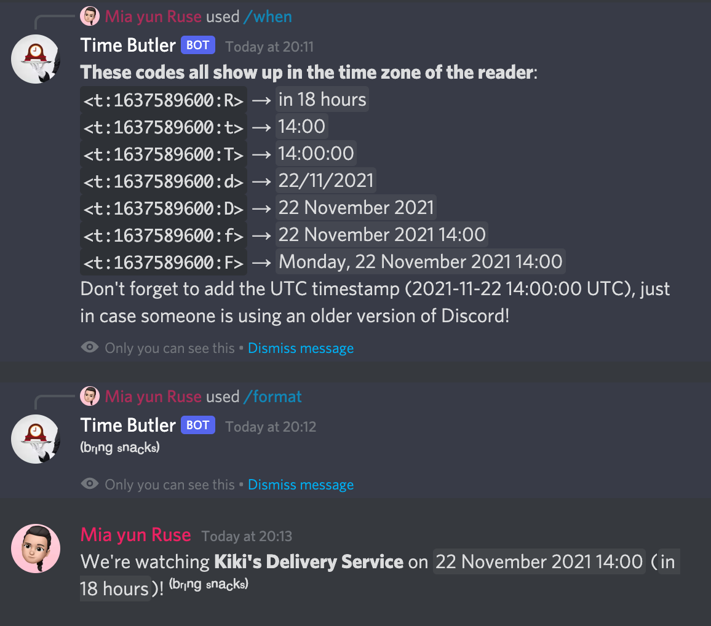

# time-butler

<!-- This bot isn't online just yet, don't invite it!

    Discord bot to help coordinate events across timezones
    

-->

Teeny tiny Discord bot to help with time zones. **The bot does not send messages to any channels** – only private replies.

- `/when` takes almost any natural-language query (in almost any language, too!) and tell you a Discord format which, when typed, will display correctly in all time zones.
- `/format` helps you quickly uʍop ǝpᴉsdn or sᴍᴀʟʟ ᴄᴀᴘs or 𝕕𝕠𝕦𝕓𝕝𝕖-𝕤𝕥𝕣𝕦𝕔𝕜 text. (Just be aware that screen-readers can't read it!)

If you want to run the bot yourself, grab Python 3.7, `pip install discord.py discord-py-slash-command dateparser`, add `oauth-token.txt` with the token to your bot user, and run `time-butler.py`.